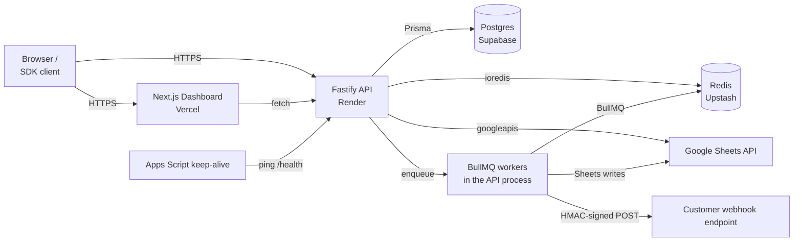
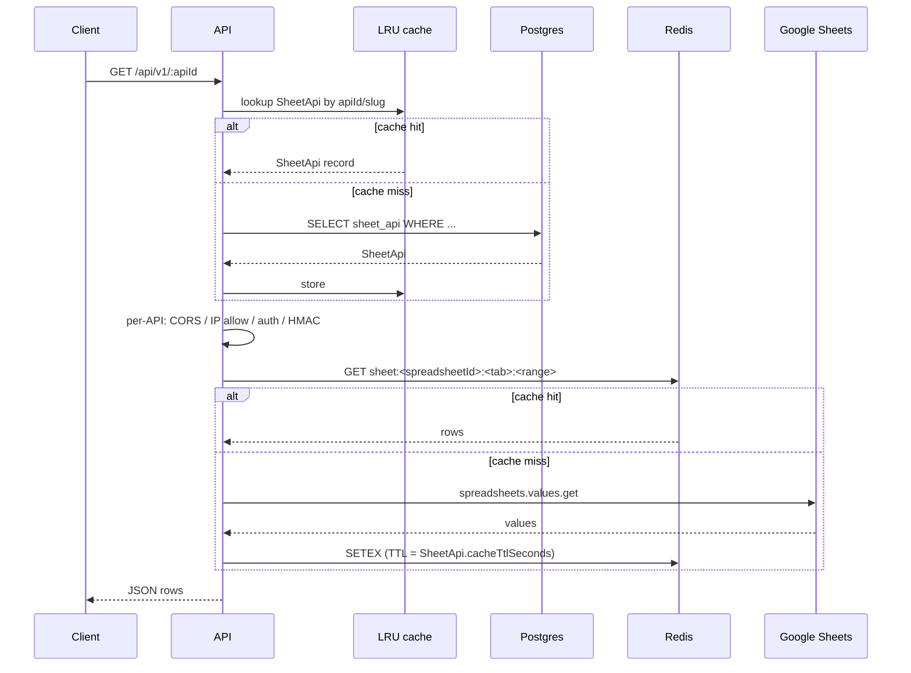
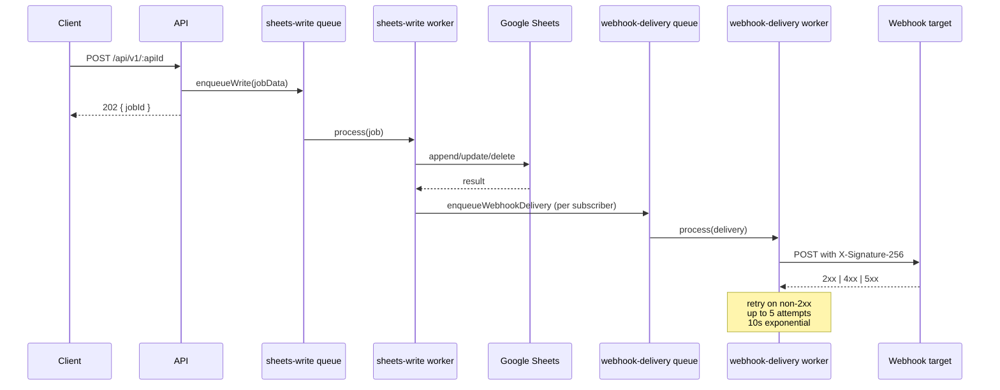

# Architecture

A 10-minute tour of how the pieces fit together. For per-feature detail, see `docs/api-reference.md`, `docs/queues.md`, `docs/hmac-signing.md`, and `docs/error-handling.md`.

## Topology

- **API + workers run in the same Node process** on Render. BullMQ workers are not a separate deployment — they share the API's connection pools.
- **Caches are in two tiers:** a per-process LRU for SheetApi config records (avoids waking Postgres on every request) and a Redis-backed cache for actual sheet data with configurable TTL per API.

## Components

| Name | What it does | Stack | Where it runs |
|---|---|---|---|
| `packages/api` | Fastify HTTP server, all routes, BullMQ workers | Node 18+, Fastify 5, Prisma 6, BullMQ | Render |
| `packages/web` | Dashboard UI: manage APIs, keys, snapshots, usage | Next.js 16, Tailwind | Vercel |
| `packages/sdk` | TypeScript client for browser + Node consumers | tsup (CJS + ESM) | Published to npm |
| Postgres | Persistent state: users, SheetApi config, snapshots, audit/usage logs | Supabase Postgres | Supabase |
| Redis | Cache + BullMQ backend | Upstash | Upstash |
| Apps Script | Wakes Render free tier from idle by hitting `/health` | Google Apps Script | Google |

## Request flow — read

Two cache layers because they protect different bottlenecks:
- The LRU layer keeps the SheetApi config lookup off Postgres (was the #1 driver of CU-hour burn before it landed).
- The Redis layer keeps Google Sheets API calls under quota.

## Request flow — write

Writes are always async because Google's write APIs are rate-limited (300/min). Synchronous handling of every POST would tip into 429s under spiky loads; the queue smooths them out. The client gets a `jobId` it can poll if it needs confirmation.

## Caches

| Layer | What it caches | Storage | Invalidation |
|---|---|---|---|
| SheetApi config LRU | SheetApi rows keyed by id and slug | Process memory | TTL + explicit invalidation on PATCH/DELETE |
| Sheet data cache | `getRawValues` / `getSheetTabs` results | Redis | TTL (`cacheTtlSeconds`, default 60s) + explicit invalidation on every successful write through the queue |

The Redis cache TTL is the upper bound on how stale data can be when no one is writing. Combined with the Apps Script trigger (every 15 min in the source spreadsheet), that's why steady-state stale-window is 60s + propagation. See [docs/queues.md](./queues.md) for what happens when the cache is invalidated by a write vs. a scheduled sync.

## Background work

Three BullMQ queues; full retry/backoff/replay docs in [docs/queues.md](./queues.md):

| Queue | Trigger | Workers | Per-job attempts |
|---|---|---|---|
| `sheets-write` | API writes | 3 (rate-limited 4/s) | 5 (2s exp backoff) |
| `webhook-delivery` | Successful writes | 5 | 5 (10s exp backoff) |
| `scheduled-sync` | Per-API cron | 2 | 3 (5s exp backoff) |

## Audit & usage logs

Both are batched in memory and flushed periodically to Postgres (see `packages/api/src/services/audit.service.ts` and `usage.service.ts`):

- **AuditLog** — dashboard mutations (create/update/delete APIs, keys, etc.). Flushed every 10s or 100 entries.
- **UsageLog** — every `/api/v1/:apiId/*` call (method, status, ms). Flushed every 10s or 200 entries.

Batching exists because Neon / Supabase free tiers count "queries" toward usage; one batched insert per 10s burns ~6 queries/min instead of ~60+/min at typical load.

On `onClose` the API drains both buffers before exiting (see `index.ts:onClose` hook), so a graceful shutdown doesn't drop pending log entries.

## Operational entry points

| When you want to … | Look at … |
|---|---|
| Tail prod logs | Render dashboard → API service → Logs (JSON stream from pino) |
| Filter by component | `component:"worker:sheets-write"` etc. (see [docs/queues.md](./queues.md)) |
| Correlate a client report | Quote the client's `X-Request-Id`; matches a pino `req.id` field |
| Inspect failed queue jobs | BullMQ Queue API or `redis-cli LRANGE bull:<queue>:failed 0 50` |
| Check Supabase usage | Supabase dashboard → Reports |
| Check Upstash usage | Upstash console → metrics |

## Boundaries

- `packages/api` is the **only** thing that talks to Google Sheets. Web and SDK go through the API.
- Workers are intentionally in-process with the API. They share the Redis + Postgres pools and respect the same shutdown lifecycle. If they ever need horizontal scaling, splitting them into a separate Render service is straightforward — they're already Worker objects with no Fastify coupling.
- The web frontend is stateless. All state lives in Postgres or Redis.
